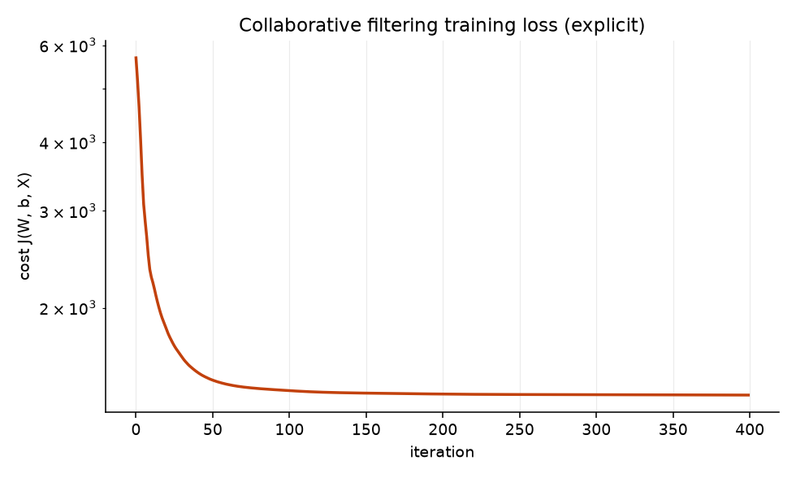

# Evaluation

Every number on this page comes from `python -m ml.evaluate` against the seeded
database. Nothing is hand-copied or rounded in the model's favour, and the
limitations section at the bottom is the part worth reading closely.

## Protocol

Ratings are split **chronologically per user**, never randomly. A random split
lets the model train on what someone thought in March and be scored on what they
thought in February — which no deployed system ever gets to do, and which
flatters every metric on the page.

```
per user, ordered by time:
  [--------- train 60% ---------][-- validation 20% --][---- test 20% ----]
```

1. Fit collaborative filtering on **train** at six regularisation strengths;
   score each on **validation**.
2. Pick λ on validation.
3. Refit **every** model — baselines included, so nobody is trained on more data
   than anyone else — on **train + validation**.
4. Report on **test**, which none of the above touched.

Steps 2 and 4 are separated on purpose. Choosing a hyperparameter on the same
data used to report the result is the most common way a model comes to look
better than it is.

| split | ratings |
| --- | --- |
| train | 9,036 |
| validation | 2,981 |
| test | 2,981 |
| users with test ratings | 475 of 500 |
| items appearing in test | 299 of 302 |

Users with fewer than 5 ratings contribute everything to train. Holding out one
of somebody's three ratings measures noise, and those users are precisely the
cold-start population the *content* model has to serve — not this one.

## Choosing λ

| λ | train RMSE | validation RMSE | validation NDCG@10 |
| --- | --- | --- | --- |
| 0.5 | 0.1706 | 0.8331 | 0.0758 |
| **1.0** | 0.2235 | 0.7591 | **0.0883** ← selected |
| 2.0 | 0.3155 | 0.7129 | 0.0832 |
| 5.0 | 0.5239 | **0.7098** | 0.0682 |
| 10.0 | 0.6998 | 0.8015 | 0.0329 |
| 20.0 | 0.7903 | 0.8723 | 0.0240 |

**The two metrics disagree, and that matters.** Validation RMSE is best at
λ=5.0; validation NDCG@10 is best at λ=1.0 and has already fallen 23% by the
time RMSE bottoms out. Selection is on NDCG, because the product ranks dishes —
it never shows anyone a predicted number.

This is worth dwelling on. Heavier regularisation shrinks the personalised part
of the prediction toward the item mean. That is a *safe* prediction, so squared
error improves; it is also a *less personalised* one, so the ordering gets
worse. Tuning this system on RMSE would have quietly optimised for blandness.

Note also that λ=0.5 has a train RMSE of 0.17 against a validation RMSE of 0.83
— a model reproducing its training data almost exactly while learning little
that transfers.

## Results

Held-out test set, 2,981 ratings, 475 users. `k = 10`, an item counts as
relevant if the held-out rating is ≥ 4.

| model | RMSE ↓ | MAE ↓ | P@10 ↑ | R@10 ↑ | NDCG@10 ↑ | coverage ↑ | pop %ile | Gini ↓ |
| --- | --- | --- | --- | --- | --- | --- | --- | --- |
| global mean | 0.9689 | 0.7628 | 0.0173 | 0.0364 | 0.0257 | 6.3% | 0.532 | 0.964 |
| item mean | 0.8870 | 0.7104 | 0.0190 | 0.0462 | 0.0331 | 5.0% | 0.303 | 0.965 |
| most popular | — | — | 0.0445 | 0.0852 | 0.0681 | 14.6% | 0.978 | 0.954 |
| collaborative filtering | 0.7268 | 0.5635 | 0.0575 | 0.1185 | 0.0908 | **74.2%** | 0.505 | **0.676** |
| **content (two-tower)** | **0.5716** | 0.4749 | **0.0711** | **0.1574** | **0.1163** | 62.9% | 0.504 | 0.709 |
| hybrid (α = 0.2) | 0.5721 | **0.4709** | 0.0702 | 0.1519 | 0.1130 | 62.6% | 0.505 | 0.732 |

`most popular` ranks by rating count, which is not a star rating, so reporting
an RMSE for it would be a number on the wrong scale. It gets a dash rather than
an invented value.

**Every learned model beats every baseline, and the content model beats
collaborative filtering.** Against item-mean, the baseline that matters:

| | collaborative filtering | content (two-tower) |
| --- | --- | --- |
| RMSE vs item-mean | 18.1% better | **35.6% better** |
| NDCG@10 vs item-mean | 174% better | **251% better** |
| vs most-popular (NDCG) | 33% better | **71% better** |

Collaborative filtering keeps one clear advantage: **74.2% catalogue coverage
against the content model's 62.9%**, and a lower Gini (0.676 vs 0.709). It
spreads recommendations more widely, which is why the blend keeps it rather
than dropping it. The section on α below explains why the content model leads
here and why that ordering should not be expected to survive contact with real
data.

### Reading the absolute numbers

P@10 of 0.0575 looks low in isolation. It is not as bad as it looks, for two
structural reasons:

1. **The random-ranking anchor is 0.0173.** The `global mean` row assigns every
   item an identical score, so its ordering is purely the random tiebreak — that
   row *is* random ranking. Collaborative filtering is **3.3× random** and the
   content model **4.1×**.
2. **Unrated means "not relevant" by convention.** Each user has roughly six
   held-out ratings among ~290 candidates. Any of the other 284 dishes they
   might have loved counts against precision, because nobody ever asked them.
   This depresses the absolute figure for every row equally, so the comparison
   between rows stays fair.

## Choosing α, and the result nobody ordered

α is selected on validation exactly as λ was — 0.6 was a configuration default,
not a measured one, and reporting a hybrid built on an unexamined constant
would present an arbitrary number as a result.

| α | validation RMSE | validation NDCG@10 |
| --- | --- | --- |
| 0.0 (content only) | 0.6085 | 0.0987 |
| **0.2** | **0.6052** | **0.1051** ← selected |
| 0.4 | 0.6220 | 0.1017 |
| 0.6 | 0.6562 | 0.0974 |
| 0.8 | 0.7022 | 0.0946 |
| 1.0 (collaborative only) | 0.7576 | 0.0880 |

**The content model beats collaborative filtering on every metric, and the
hybrid does not beat the content model alone.** Selecting α honestly moved the
hybrid from 0.6240 to 0.5721 RMSE, but content-only still edges it on test
(0.5716 / 0.1163 against 0.5721 / 0.1130). α = 0.2 won on validation and came
back fractionally behind on test, a gap well inside the noise of a single split.

This inverts the architecture the brief assumes, where collaborative filtering
is the main event and content-based filtering is the cold-start fallback. It is
worth being precise about why, because the reason is almost certainly **an
artifact of the data being synthetic**:

The generator produces a rating from a cuisine affinity, a spice-tolerance
penalty, a per-item quality term and noise. The content model receives cuisine,
spice level, the user's stated spice tolerance and their per-cuisine rating
history *as direct inputs* — so it is being handed the generator's own
parameters and can very nearly invert them. Collaborative filtering has to
rediscover that same structure from sparse co-ratings, which is a strictly
harder problem.

Real customers are not generated from a tidy function of the features the
catalogue happens to record. On real data the usual ordering — collaborative
filtering ahead on users with history, content-based carrying the cold start —
is far more likely, which is why the serving code keeps both and blends them
rather than dropping the collaborative half on the strength of this table.
**Re-run the sweep before trusting α = 0.2 anywhere real.**

## Popularity bias

The check that a good ranking score can hide entirely.

| model | recommendations landing in the top popularity decile |
| --- | --- |
| most popular | **99.5%** |
| global mean | 15.6% |
| collaborative filtering | **10.3%** |
| item mean | 0.0% |

The top decile is 10% of the catalogue, so a recommender with no popularity
preference would sit near 10%. Collaborative filtering lands at 10.3% — it is
essentially popularity-neutral, and its Gini of 0.676 against 0.95+ for every
baseline says the same thing: it spreads recommendations across the menu instead
of funnelling everyone to the same shelf.

`item mean` fails in the opposite and less obvious direction. Its 0.0% top-decile
share and 0.303 mean popularity percentile mean it recommends *obscure* dishes —
items with two or three glowing ratings and a high average. An unregularised
average is a bad ranking signal precisely when it is based on very little data.

## Training



Cost falls from 5,691 to 1,388 over 400 iterations and is flat by roughly 200.
The axis is logarithmic because the first few steps dwarf everything after them.

## Limitations

Read this section before quoting any number above.

1. **The data is synthetic, and I planted the structure the models find.** The
   three taste clusters were written into the generator by hand. Collaborative
   filtering recovering them is therefore partly circular: it confirms the
   pipeline works end to end, and it does *not* establish that the same
   architecture would find real structure in a real restaurant's order log. This
   is the largest caveat on the page by some distance, and the section above on
   α is what it looks like when that caveat stops being theoretical — the
   content model wins here largely because it is fed the generator's own
   parameters.

2. **The matrix is denser than reality.** 9.93% against 1–5% for a typical
   ordering platform. Sparser data would hurt collaborative filtering more than
   it hurts the popularity baseline.

3. **Per-user chronological splitting still leaks a little.** User A's training
   rating may be more recent than user B's test rating. A single global timestamp
   cutoff would remove that, but it would also strip every recently-joined user
   of training history — throwing away most of the cold-start population the
   system specifically exists to handle. Per-user is the lesser distortion, not
   a clean simulation of deployment.

4. **One split, one seed, no confidence intervals.** Every figure is a single
   point estimate. Differences of a percent or two between rows should not be
   read as real.

5. **Cold-start users are excluded by construction.** The 25 users below the
   5-rating threshold contribute only to training, so no number here says
   anything about how the system treats a brand-new customer. That is the
   content model's job and it is measured in M6, not here.

6. **Cold-start items are barely represented.** 299 of 302 items appear in the
   test set, so item-side cold start is essentially untested by this table.

7. **Only λ and α were tuned**, over coarse six-point grids. The collaborative
   latent dimension is fixed at n=10 and its learning rate at 0.1; the towers
   are fixed at 256→128→32 with no architecture search at all. None of those
   were tuned, so the content model's lead is not the result of it having been
   optimised harder — if anything the opposite.

8. **Relevance is a threshold, not a preference.** Treating ≥4 stars as "liked"
   discards the difference between a 4 and a 5, and NDCG is computed on binary
   gains rather than graded ones.

## Reproducing

```bash
cd backend
python -m scripts.seed --reset      # deterministic, --seed 42
python -m ml.evaluate               # writes data/evaluation.json
```

The seed is fixed and training is deterministic, so these figures reproduce
exactly. Full machine-readable output, including the λ sweep, lands in
`backend/data/evaluation.json`.
